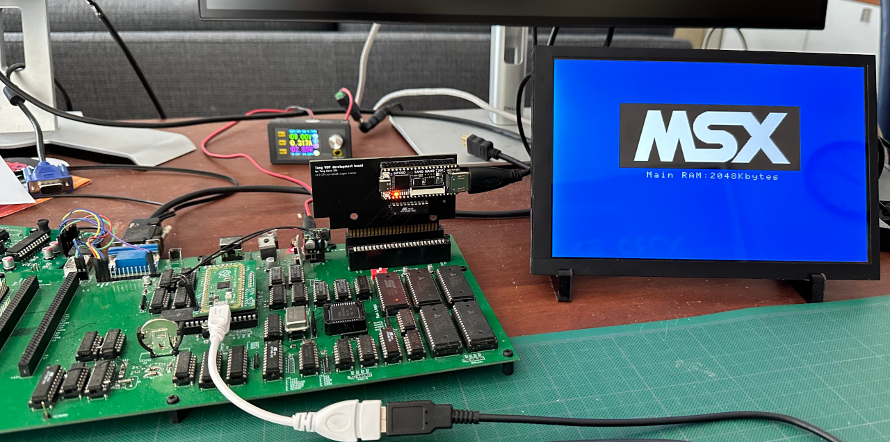
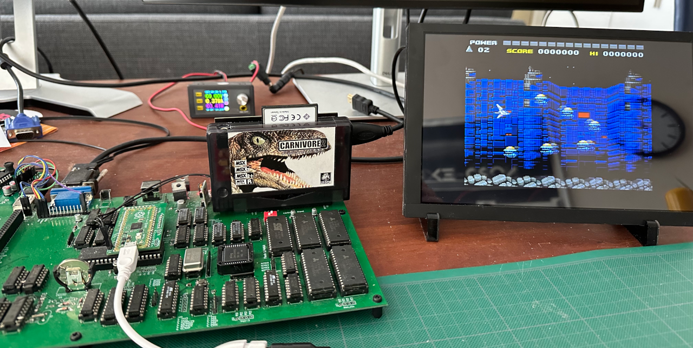
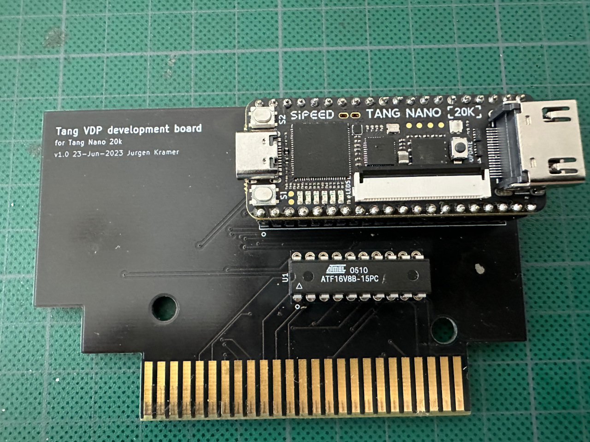
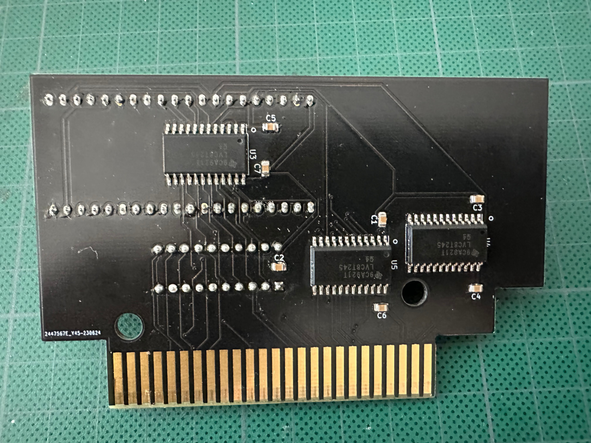

# tang-msx-vdp
Development of a custom VDP for MSX using the Tang Nano 20k board.
Using System Verilog as the primary language instead of my go language VHDL.

More to follow...

# Proof of concept running TN VDP V3 V9958
As a proof of concept, converted TN VDP V3 V9958 to run on this board:

